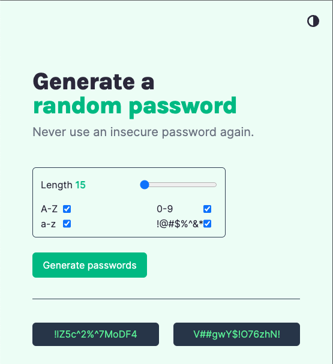
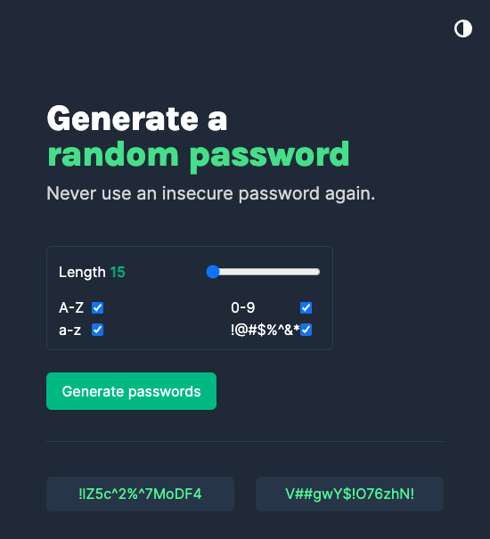

# Random Password Generator

Random Password Generator built with vanilla JavaScript and CSS. Used CSS variables to help implement dark mode. Password generation logic ensures that selected character types (uppercase, lowercase, numbers, symbols) are used at minimum once in the generated password.

### Light mode

### Dark mode

## Attributions
https://www.w3docs.com/snippets/javascript/how-to-randomize-shuffle-a-javascript-array.html